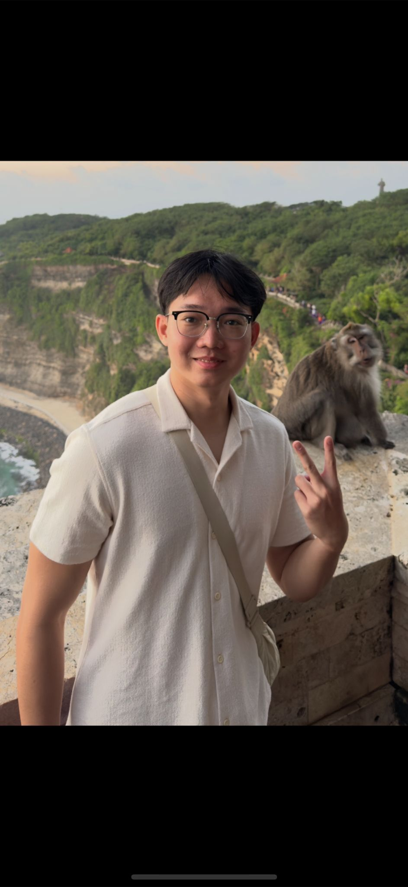
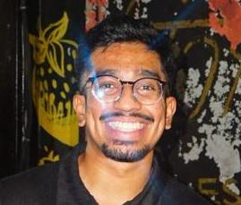
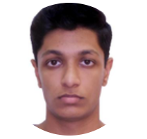
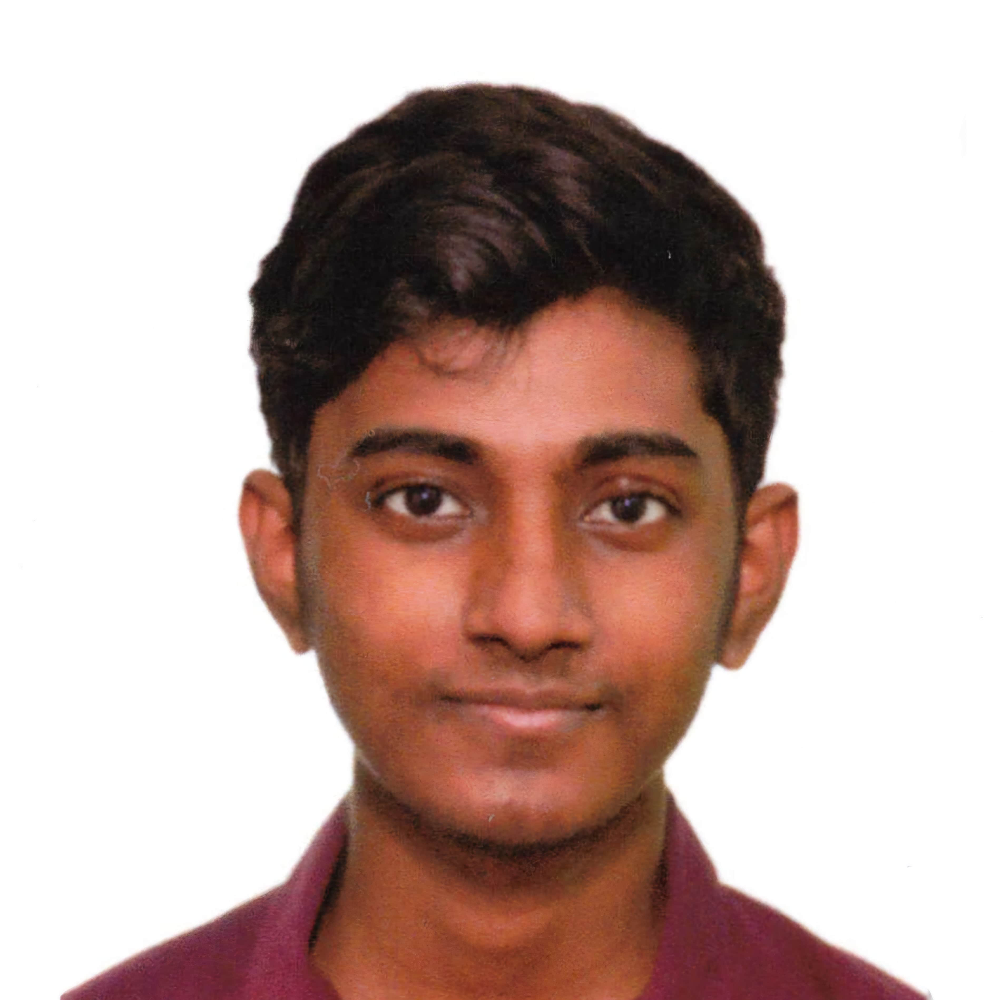

We are a team based in the [School of Computing, National University of Singapore](https://www.comp.nus.edu.sg).

You can reach us at the email `seer[at]comp.nus.edu.sg`

## Project team

### Kaung Khant Minn

[[homepage](http://www.comp.nus.edu.sg/~damithch)]
[[github](https://github.com/Khantminn290)]
[[portfolio](team/johndoe.md)]

* Role: Team member/Developer

### Saajid Ahamed

[[github](https://github.com/saajid-ahamed)]
[[portfolio](team/johndoe.md)]

* Role: Team Member
* Responsibilities: UI

### Samuel Christy George

[[github](http://github.com/samuelcg20)] [[portfolio](team/johndoe.md)]

* Role: Team Member/Developer
* Responsibilities: Data

### Stalin Muthukumar Bill Sujith Kumaar

[[github](http://github.com/sbillsujithkumaar)] [[portfolio](team/johndoe.md)]

* Role: Team Member, Deliverables and deadlines
* Responsibilities: Ensure project deliverables are done on time and in the right format

### Jean Doe

[[github](http://github.com/johndoe)]
[[portfolio](team/johndoe.md)]

* Role: Developer
* Responsibilities: Dev Ops + Threading

### James Doe

[[github](http://github.com/johndoe)]
[[portfolio](team/johndoe.md)]

* Role: Developer
* Responsibilities: UI
