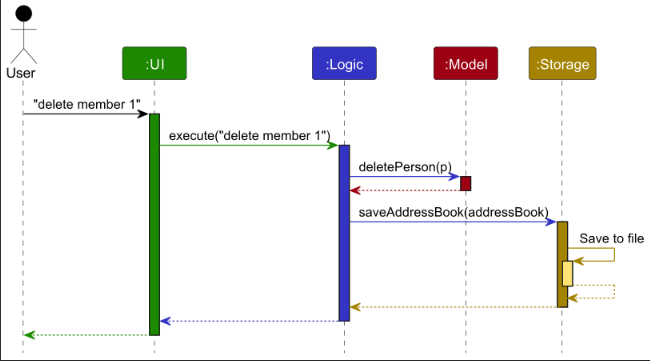
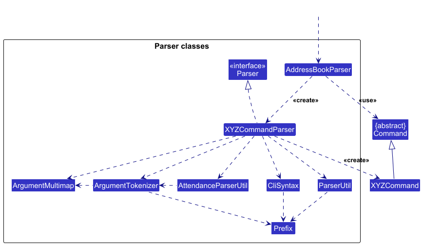
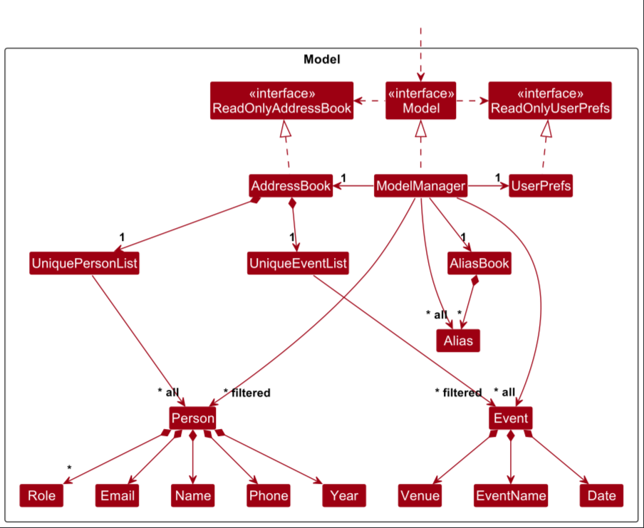
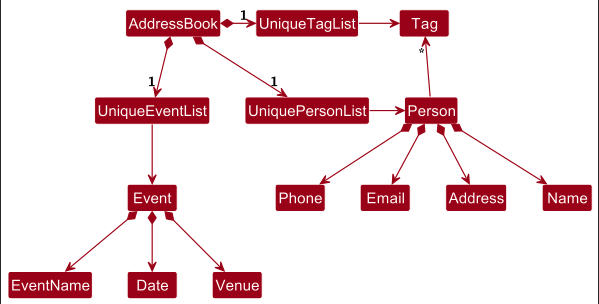
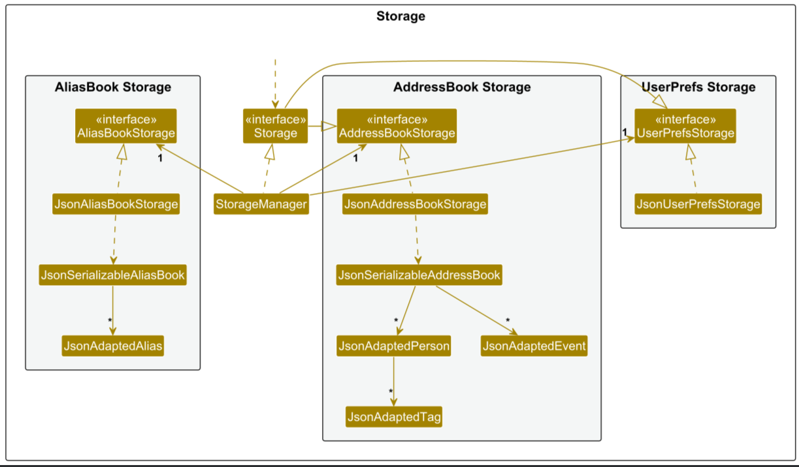
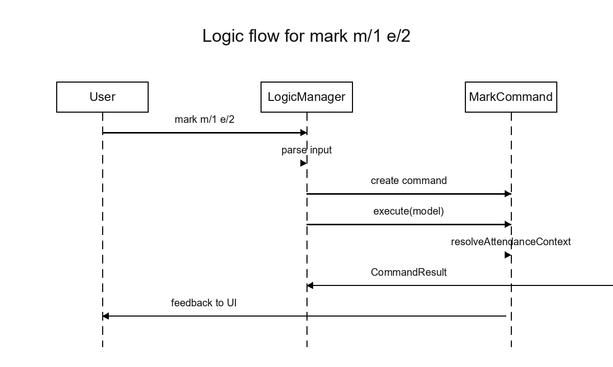
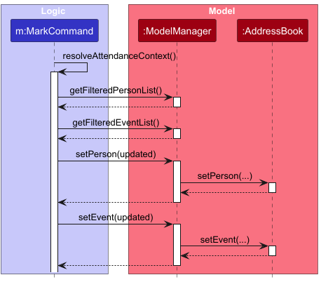

* Table of Contents
{:toc}

--------------------------------------------------------------------------------------------------------------------

## **Acknowledgements**

* {list here sources of all reused/adapted ideas, code, documentation, and third-party libraries -- include links to the original source as well}

--------------------------------------------------------------------------------------------------------------------

## **Setting up, getting started**

Refer to the guide [_Setting up and getting started_](SettingUp.md).

--------------------------------------------------------------------------------------------------------------------

## **Design**

<div markdown="span" class="alert alert-primary">

:bulb: **Tip:** The `.puml` files used to create diagrams are in this document `docs/diagrams` folder. Refer to the [_PlantUML Tutorial_ at se-edu/guides](https://se-education.org/guides/tutorials/plantUml.html) to learn how to create and edit diagrams.
</div>

### Architecture


The ***Architecture Diagram*** given above explains the high-level design of the App.

Given below is a quick overview of main components and how they interact with each other.

**Main components of the architecture**

**`Main`** (consisting of classes [`Main`](https://github.com/se-edu/addressbook-level3/tree/master/src/main/java/seedu/address/Main.java) and [`MainApp`](https://github.com/se-edu/addressbook-level3/tree/master/src/main/java/seedu/address/MainApp.java)) is in charge of the app launch and shut down.
* At app launch, it initializes the other components in the correct sequence, and connects them up with each other.
* At shut down, it shuts down the other components and invokes cleanup methods where necessary.

The bulk of the app's work is done by the following four components:

* [**`UI`**](#ui-component): The UI of the App.
* [**`Logic`**](#logic-component): The command executor.
* [**`Model`**](#model-component): Holds the data of the App in memory.
* [**`Storage`**](#storage-component): Reads data from, and writes data to, the hard disk.

[**`Commons`**](#common-classes) represents a collection of classes used by multiple other components.

**How the architecture components interact with each other**

The *Sequence Diagram* below shows how the components interact with each other for the scenario where the user issues the command `delete 1`.



Each of the four main components (also shown in the diagram above),

* defines its *API* in an `interface` with the same name as the Component.
* implements its functionality using a concrete `{Component Name}Manager` class (which follows the corresponding API `interface` mentioned in the previous point.

For example, the `Logic` component defines its API in the `Logic.java` interface and implements its functionality using the `LogicManager.java` class which follows the `Logic` interface. Other components interact with a given component through its interface rather than the concrete class (reason: to prevent outside component's being coupled to the implementation of a component), as illustrated in the (partial) class diagram below.


The sections below give more details of each component.

### UI component

The **API** of this component is specified in [`Ui.java`](https://github.com/se-edu/addressbook-level3/tree/master/src/main/java/seedu/address/ui/Ui.java)


The UI consists of a `MainWindow` that is made up of parts e.g.`CommandBox`, `ResultDisplay`, `PersonListPanel`, `StatusBarFooter` etc. All these, including the `MainWindow`, inherit from the abstract `UiPart` class which captures the commonalities between classes that represent parts of the visible GUI.

The `UI` component uses the JavaFx UI framework. The layout of these UI parts are defined in matching `.fxml` files that are in the `src/main/resources/view` folder. For example, the layout of the [`MainWindow`](https://github.com/se-edu/addressbook-level3/tree/master/src/main/java/seedu/address/ui/MainWindow.java) is specified in [`MainWindow.fxml`](https://github.com/se-edu/addressbook-level3/tree/master/src/main/resources/view/MainWindow.fxml)

The `UI` component,

* executes user commands using the `Logic` component.
* listens for changes to `Model` data so that the UI can be updated with the modified data.
* keeps a reference to the `Logic` component, because the `UI` relies on the `Logic` to execute commands.
* depends on some classes in the `Model` component, as it displays `Person` object residing in the `Model`.

### Logic component

**API** : [`Logic.java`](https://github.com/se-edu/addressbook-level3/tree/master/src/main/java/seedu/address/logic/Logic.java)

Here's a (partial) class diagram of the `Logic` component:


The sequence diagram below illustrates the interactions within the `Logic` component, taking `execute("delete member 1")` API call as an example.


<div markdown="span" class="alert alert-info">:information_source: **Note:** The lifeline for `DeleteCommandParser` should end at the destroy marker (X) but due to a limitation of PlantUML, the lifeline continues till the end of diagram.
</div>

How the `Logic` component works:

1. When `Logic` is called upon to execute a command, it is passed to an `AddressBookParser` object which in turn creates a parser that matches the command (e.g., `DeleteCommandParser`) and uses it to parse the command.
1. This results in a `Command` object (more precisely, an object of one of its subclasses e.g., `DeleteCommand`) which is executed by the `LogicManager`.
1. The command can communicate with the `Model` when it is executed (e.g. to delete a person).<br>
   Note that although this is shown as a single step in the diagram above (for simplicity), in the code it can take several interactions (between the command object and the `Model`) to achieve.
1. The result of the command execution is encapsulated as a `CommandResult` object which is returned back from `Logic`.

Here are the other classes in `Logic` (omitted from the class diagram above) that are used for parsing a user command:



How the parsing works:
* When called upon to parse a user command, the `AddressBookParser` class creates an `XYZCommandParser` (`XYZ` is a placeholder for the specific command name e.g., `AddCommandParser`) which uses the other classes shown above to parse the user command and create a `XYZCommand` object (e.g., `AddCommand`) which the `AddressBookParser` returns back as a `Command` object.
* All `XYZCommandParser` classes (e.g., `AddCommandParser`, `DeleteCommandParser`, ...) inherit from the `Parser` interface so that they can be treated similarly where possible e.g, during testing.

### Model component
**API** : [`Model.java`](https://github.com/AY2526S1-CS2103T-T09-2/tp/blob/master/src/main/java/seedu/address/model/Model.java)




The `Model` component:

* stores the address book data, i.e. all `Person` and `Event` objects (contained in a `UniquePersonList` and `UniqueEventList` respectively within the `AddressBook`).
* stores user-defined command shortcuts in an `AliasBook`, which maps alias words to actual command words.
* maintains filtered views of both members and events (`FilteredList<Person>` and `FilteredList<Event>`).  
  These are exposed to the outside as unmodifiable `ObservableList`s so that the UI can automatically update when the underlying data changes.
* stores a `UserPrefs` object that represents the user’s GUI settings, file paths, and other user-specific preferences.  
  This is exposed externally as a `ReadOnlyUserPrefs` object.
* does not depend on any of the other components (as the `Model` represents core data entities that should make sense on their own).

<div markdown="span" class="alert alert-info">:information_source: **Note:** An alternative (arguably, a more OOP) model is given below. It has a `Tag` list in the `AddressBook`, which `Person` references. This allows `AddressBook` to only require one `Tag` object per unique tag, instead of each `Person` needing their own `Tag` objects.<br>



</div>


### Storage component

**API** : [`Storage.java`](https://github.com/AY2526S1-CS2103T-T09-2/tp/blob/master/src/main/java/seedu/address/storage/Storage.java)



The `Storage` component,
* can save both address book data, alias book data and user preference data in JSON format, and read them back into corresponding objects.
* inherits from `AddressBookStorage`, `AliasBookStorage` and `UserPrefStorage`, which means it can be treated as either one (if only the functionality of only one is needed).
* depends on some classes in the `Model` component (because the `Storage` component's job is to save/retrieve objects that belong to the `Model`)

The address book JSON structure contains two top-level arrays: `persons` and `events`. Each `person` is serialized via `JsonAdaptedPerson`, and each `event` via `JsonAdaptedEvent`.

Example (abridged):

```
{
  "persons": [
    { "name": "Alex Yeoh", "phone": "87438807", "email": "alexyeoh@u.nus.edu", "year": "1", "tags": [] }
  ],
  "events": [
    { "name": "Welcome Tea", "date": "2025-12-30T18:00", "venue": "COM1-01" }
  ]
}
```
The alias book JSON structure contains one-level array: `alias`. Each `alias` is serialized via `JsonAdaptedAlias`.

Example (abridged):

```
{
  "aliases" : [ {
    "commandWord" : "delete",
    "aliasWord" : "d"
  } ]
}
```

### Common classes

Classes used by multiple components are in the `seedu.address.commons` package.

--------------------------------------------------------------------------------------------------------------------

## **Implementation**

This section describes some noteworthy details on how certain features are implemented.

### Attendance feature

#### Implementation

The attendance feature lets CCA leaders record participation for each event via the `mark` and `unmark` commands. It spans the Logic, Model, Storage, and UI layers:

`MarkCommand` and `UnmarkCommand` sit on top of a shared `AttendanceCommand` base to keep validation, parsing, and model updates consistent. `AttendanceParserUtil` handles shared CLI syntax (`m/` for member index and `e/` for event index), the `ModelManager` updates both `Person` and `Event` records, storage serialises the updated state, and the UI renders the refreshed attendance counts and attendee lists.

Key operations exposed by the attendance feature:

* `AttendanceCommand#resolveAttendanceContext(...)` – looks up the targeted member and event in the currently filtered lists, throwing if either index is invalid.
* `AttendanceParserUtil#parseIndexes(...)` – tokenises `m/` and `e/` prefixes, forbids duplicates, and produces the `Index` values shared by both commands.
* `MarkCommand#execute(...)` – increments the selected member's attendance count and appends their name to the chosen event.
* `UnmarkCommand#execute(...)` – removes the member's name from the event and clamps the member's attendance count so it cannot drop below zero.
* `ModelManager` helpers (`cleanupPersonAttendance(...)`, `updatePersonNameInAttendance(...)`, `cleanupEventAttendance(...)`) – keep attendance data coherent when members or events are edited, cleared, or deleted.
* `JsonAdaptedPerson` / `JsonAdaptedEvent` – persist the updated attendance count and comma-delimited attendee list.
* `PersonCard` / `EventCard` – surface the synchronised count and attendee names in the UI.

Steps below illustrate how the mark/unmark workflow plays out:

Step 1. A leader ensures both the members and events panes show the desired entries (usually by running `list members` and `list events`). The `AttendanceCommand` subclass will resolve indexes only against these filtered lists.

Step 2. The leader executes `mark m/1 e/2`. `LogicManager` parses the command word, instantiates `MarkCommand`, and invokes `execute(model)`, as shown in the logic sequence diagram.



Step 3. Inside `execute(...)`, the command resolves the context, increments the member's attendance count, and appends the member name to the event. `ModelManager` writes both updates through to the underlying `AddressBook` while the storage layer keeps the JSON payloads consistent. The model sequence diagram highlights how `MarkCommand`, `ModelManager`, and the `AddressBook` collaborate to persist the changes.



Step 4. If the leader later issues `unmark` for the same indices, the command uses the same validation path, reverses the event update, and clamps the member's count. The UI immediately reflects the change because it is observing the filtered lists.

<div markdown="span" class="alert alert-info">:information_source: **Note:** `MarkCommand` guards against duplicate attendance. Attempting to mark an already recorded member results in a clear validation error without modifying either record.</div>

```java
// Core of mark execution
public CommandResult execute(Model model) throws CommandException {
    AttendanceContext context =
            resolveAttendanceContext(model, MESSAGE_INVALID_MEMBER_INDEX, MESSAGE_INVALID_EVENT_INDEX);
    Person memberToMark = context.getMember();
    Event eventToMark = context.getEvent();

    if (eventToMark.hasAttendee(memberToMark.getName().fullName)) {
        throw new CommandException(MESSAGE_DUPLICATE_ATTENDANCE);
    }

    Person updatedMember = memberToMark.withAttendanceCount(memberToMark.getAttendanceCount() + 1);
    model.setPerson(memberToMark, updatedMember);

    Event updatedEvent = eventToMark.addToAttendanceList(memberToMark.getName().fullName);
    model.setEvent(eventToMark, updatedEvent);

    return new CommandResult(MESSAGE_SUCCESS);
}
```

#### Example usage

1. A CCA leader lists members and events so the relevant entries are visible.
2. The leader runs `mark m/1 e/2`. `AttendanceCommand#resolveAttendanceContext` resolves the first visible member and second visible event, guaranteeing both indexes are valid within the filtered lists.
3. `MarkCommand` increments the member's attendance count and appends the member name to the chosen event. The UI cards update immediately to display the new count and attendee list.
4. If the leader later runs `unmark m/1 e/2`, the command reverses the updates to keep both records synchronised.

#### Design considerations

**Aspect: Tracking attendance counts**

* Alternative: derive counts by scanning every event. Rejected because the UI and storage layers would need to recompute the aggregate repeatedly, hurting responsiveness and complicating persistence.
* Current choice: store the counter directly on `Person`. The `ModelManager` clean-up hooks ensure the counter never drifts away from the event data.

**Aspect: Representing event attendees**

* Alternative: retain references to `Person` objects. This risks stale pointers after edits and introduces circular serialisation concerns.
* Current choice: store canonical member names in a single delimited `String` (`Event.ATTENDANCE_DELIMITER`). It keeps persistence simple and allows easy rewrites when names change.

**Aspect: Command syntax**

* Alternative: accept member/event names. This becomes ambiguous when duplicates exist and breaks consistency with other index-based commands.
* Current choice: reuse one-based indexes so the commands remain unambiguous with filtered lists and align with the rest of the CLI.


--------------------------------------------------------------------------------------------------------------------

## **Documentation, logging, testing, configuration, dev-ops**

* [Documentation guide](Documentation.md)
* [Testing guide](Testing.md)
* [Logging guide](Logging.md)
* [Configuration guide](Configuration.md)
* [DevOps guide](DevOps.md)

--------------------------------------------------------------------------------------------------------------------

## **Appendix: Requirements**

### Product scope

**Target user profile**: NUS CCA leaders

* has a need to manage a significant number of member contacts
* needs to track CCA members' attendance for event participation
* classify members into their different roles
* prefer desktop apps over other types
* can type fast
* prefers typing to mouse interactions
* is reasonably comfortable using CLI apps


**Value proposition**: keep track of members and events easily with simple one-line commands. Record
attendance for members and filter members by event attendance.


### User stories

Priorities: High (must have) - `* * *`, Medium (nice to have) - `* *`, Low (unlikely to have) - `*`

| Priority | As a …​              | I want to …​                                  | So that I can…​                                                                                   |
|--------|----------------------|-----------------------------------------------|---------------------------------------------------------------------------------------------------|
| `* * *` | CCA leader           | add a new member with their details           | keep a complete active member list                                                                |
| `* * *` | CCA leader           | delete a member                               | remove inactive members                                                                           |
| `* * *` | CCA leader           | add an event with date/time                   | track attendance later                                                                            |
| `* * *` | CCA leader/secretary | view the entire address book details | retrieve info from the address book and also be sure that it always stays accurate and up to date |
| `* * *` | CCA leader           | delete an event                      | remove cancelled events                                                                           |
| `* *`  | CCA leader           | create aliases for commands                 | type faster by using shorter, personalised command names                                          |
| `* *`  | CCA leader           | view a guided tour                 | learn the main interface features easily without referring back to the guide                      |
| `* *`  | CCA leader           | search for members or events by keywords               | find specific entries quickly without scrolling through long lists                                |
| `*`    | CCA leader           | undo or redo my last action                 | reverse mistakes such as deleting the wrong entry                                                 |


### Use cases

(For all use cases below, the **System** is the `ComClubConnect` and the **Actor** is the `user`, unless specified otherwise)

**<a id="use-case-list-members"></a>UC1: List members**

**MSS**

1.  User requests to list members.
2.  ComClubConnect displays the member list.

    Use case ends.

**Extensions**

- 1a. The members list is empty.
    - 1a1. ComClubConnect displays an empty list. 
    - Use case ends.
- 1b. The input is invalid.
    - 1b1. ComClubConnect informs user on invalid input.
    - Use case ends.

**<a id="use-case-list-events"></a>UC2: List events**

**MSS**

1.  User requests to list events.
2.  ComClubConnect displays the events list.

    Use case ends.

**Extensions**

- 1a. The events list is empty.
    - 1a1. ComClubConnect displays an empty list.
    - Use case ends.
- 1b. The input is invalid.
    - 1b1. ComClubConnect informs user on invalid input.
    - Use case ends.


**UC3: Add a Member**

**MSS**

1. User requests to add a member.
2. ComClubConnect adds the new member to the list.
3. ComClubConnect confirms that the member has been added successfully.

    Use case ends.

**Extensions**

- 1a. ComClubConnect detects duplicate member.
    - 1a1. ComClubConnect informs user on duplicate member being present.
    - Use case ends.
- 1b. ComClubConnect detects invalid input.
    - 1b1. ComClubConnect informs user on invalid input.
    - Use case ends.

**UC4: Add an event**

**MSS**

1. User requests to add an event.
2. ComClubConnect adds the new event to the list.
3. ComClubConnect confirms that the event has been added successfully.

   Use case ends.

**Extensions**

- 1a. ComClubConnect detects duplicate event.
    - 1a1. ComClubConnect informs user on duplicate event being present.
    - Use case ends.
- 1b. ComClubConnect detects invalid input.
    - 1b1. ComClubConnect informs user on invalid input.
    - Use case ends.

**UC5: Delete a member**

**MSS**

1. User performs [<u>UC1: list members</u>](#use-case-list-members).
2. User requests to delete a member in the displayed list by index.
3. ComClubConnect deletes the specified member.
4. ComClubConnect confirms that the member has been deleted.

   Use case ends.

**Extensions**

- 1a. The displayed list is empty.
    - Use case ends.
- 2a. ComClubConnect detects index is invalid.
    - 2a1. ComClubConnect informs user on invalid index.
    - Use case ends.

**UC6: Delete an event**

**MSS**

1. User performs [<u>UC2: list events</u>](#use-case-list-events).
2. User requests to delete an event in the displayed list by index.
3. ComClubConnect deletes the specified event.
4. ComClubConnect confirms that the event has been deleted.

   Use case ends.

**Extensions**

- 1a. The displayed list is empty.
    - Use case ends.
- 2a. ComClubConnect detects index is invalid.
    - 2a1. ComClubConnect informs user on invalid index.
    - Use case ends.

**UC7: Edit a member**

**MSS**

1. User performs [<u>UC1: list members</u>](#use-case-list-members).
2. User requests to edit a member in the displayed list.
3. ComClubConnect edits the specified member.
4. ComClubConnect confirms that the member has been edited.

   Use case ends.

**Extensions**

- 1a. The displayed list is empty.
    - Use case ends.
- 2a. ComClubConnect detects input is invalid.
    - 2a1. ComClubConnect informs user on invalid index.
    - Use case ends.

**UC8: Edit an event**

**MSS**

1. User performs [<u>UC2: list events</u>](#use-case-list-events).
2. User requests to edit an event in the displayed list.
3. ComClubConnect edits the specified event.
4. ComClubConnect confirms that the event has been edited.

   Use case ends.

**Extensions**

- 1a. The displayed list is empty.
    - Use case ends.
- 2a. ComClubConnect detects input is invalid.
    - 2a1. ComClubConnect informs user on invalid index.
    - Use case ends.

**UC9: Find members**

**MSS**

1. User performs [<u>UC1: list members</u>](#use-case-list-members).
2. User requests to find members in the displayed list.
3. ComClubConnect checks input and displays filtered list containing members that meet the filter requirements.
4. ComClubConnect confirms that the members have been found.

   Use case ends.

**Extensions**

- 2a. ComClubConnect detects input is invalid.
    - 2a1. ComClubConnect informs user on invalid input.
    - Use case ends.

**UC10: Find events**

**MSS**

1. User performs [<u>UC2: list events</u>](#use-case-list-events).
2. User requests to find events in the displayed list.
3. ComClubConnect checks input and displays filtered list containing events that meet the filter requirement.
4. ComClubConnect confirms that the events have been found.

   Use case ends.

**Extensions**

- 2a. ComClubConnect detects input is invalid.
    - 2a1. ComClubConnect informs user on invalid input.
    - Use case ends.

**UC11: Clear all members**

**MSS**

1. User requests to clear all members.
2. ComClubConnect clears all members from the list.
3. ComClubConnect confirms that all members have been cleared.

   Use case ends.

**Extensions**

- 2a. ComClubConnect detects command is invalid.
    - 2a1. ComClubConnect informs user on invalid command.
    - Use case ends.

**UC12: Clear all events**

**MSS**

1. User requests to clear all events.
2. ComClubConnect clears all events from the list.
3. ComClubConnect confirms that all events have been cleared.

   Use case ends.

**Extensions**

- 2a. ComClubConnect detects command is invalid.
    - 2a1. ComClubConnect informs user on invalid command.
    - Use case ends.

**UC13: Exit ComClubConnect**

**MSS**

1. User requests to exit ComClubConnect.
2. ComClubConnect acknowledges and closes the window.
   Use case ends.

**Extensions**

- 1a. ComClubConnect detects command is invalid.
    - 1a1. ComClubConnect informs user on invalid command.
    - Use case ends.

**UC14: View help information**

**MSS**

1. User requests to view help information.
2. ComClubConnect opens the help window.
3. User acknowledges and closes the help window.
   Use case ends.

**Extensions**

- 2a. User requests for guided tour from the help window.
    - 2a1. ComClubConnect starts the guided tour.
    - 2a2. User navigates through the guided tour.
    - 2a3. ComClubConnect closes the guided tour
    - Use case resumes at step 3.

**UC15: Create a command alias**

**MSS**

1. User requests to create a new alias for an existing command.
2. ComClubConnect saves the alias mapping.
3. ComClubConnect confirms that the alias was created successfully.
   Use case ends.

**Extensions**

- 1a. ComClubConnect detects alias command already exists.
    - 1a1. ComClubConnect informs user on the already existing alias command.
    - Use case ends.

**UC16: Mark a member's attendance for an event**

**MSS**

1. User performs [<u>UC1: list members</u>](#use-case-list-members).
2. User performs [<u>UC2: list events</u>](#use-case-list-events).
3. User requests to mark a particular member's attendance for a particular event.
4. ComClubConnect marks the attendance of the member as requested by user.
5. ComClubConnect confirms that the member's attendance for the event was marked.
   Use case ends.

**Extensions**

- 3a. ComClubConnect detects input is invalid.
    - 3a1. ComClubConnect informs user on the invalid input.
    - Use case ends.

**UC17: Unmark a member's attendance for an event**

**MSS**

1. User performs [<u>UC1: list members</u>](#use-case-list-members).
2. User performs [<u>UC2: list events</u>](#use-case-list-events).
3. User requests to unmark a particular member's attendance for a particular event.
4. ComClubConnect unmarks the attendance of the member as requested by user.
5. ComClubConnect confirms that the member's attendance for the event was unmarked.
   Use case ends.

**Extensions**

- 3a. ComClubConnect detects input is invalid.
    - 1a1. ComClubConnect informs user on the invalid input.
    - Use case ends.

### Non-Functional Requirements

1.  Should work on any _mainstream OS_ as long as it has Java `17` installed.
2.  The system should be able to handle at least 50 members and 20 events without noticeable sluggishness in performance for typical usage.
3.  Core commands (add, delete, list) should return results within 1 second for datasets within these limits.
4.  Error messages should be clear, specific, and actionable, guiding the user to correct invalid inputs.
5.  Member and event records must be stored persistently in a database, with all changes saved immediately (within 1 second) to ensure no data is lost between application restarts or failures.
6.  The system must validate all input to prevent injection of unsupported or malicious characters.
7.  The application should start up and be ready to accept commands within 8 seconds on a typical laptop.
8.  All stored data should be in a human-readable text format (e.g., JSON/XML/CSV) so that it can be migrated easily to another system if needed.


### Glossary

* **Mainstream OS**: Windows, Linux, Unix, MacOS
* **Graphical User Interface (GUI)**: A visual interface that allows users to interact with the application through elements like buttons, menus, and windows instead of typing commands.
* **Address Book**: A digital contact management system that stores details of CCA members (e.g., name, phone, email, role).
* **Index**: A numerical identifier assigned to members or events in a displayed list, used for referencing in commands (e.g., delete member 2).
* **Command**: A specific instruction entered by the user into the CLI to perform an action (e.g., add n/John Doe …, delete member 1).
* **Persistence**: The ability of the system to save data (members and events) so that it remains available across multiple sessions.
* **Error Message**: A feedback response from the system that informs the user about invalid or incorrect inputs (e.g., invalid phone number, missing parameters).
* **Command Line Interface(CLI)**: A text-based user interface where users type in commands (e.g., add, delete, list) instead of using graphical menus.
* **Member**: An individual registered in the CCA with details such as name, contact number, email, and role.

--------------------------------------------------------------------------------------------------------------------

## **Appendix: Instructions for manual testing**

Given below are instructions to test the app manually.

<div markdown="span" class="alert alert-info">:information_source: **Note:** These instructions only provide a starting point for testers to work on;
testers are expected to do more *exploratory* testing.

</div>

### Launch and shutdown

1. Initial launch

   1a. Download the jar file and copy into an empty folder

   1b. Double-click the jar file 
       Expected: Shows the GUI with a set of sample contacts. The window size may not be optimum.

2. Saving window preferences

   2a. Resize the window to an optimum size. Move the window to a different location. Close the window.

   2b. Re-launch the app by double-clicking the jar file.<br>
       Expected: The most recent window size and location is retained.


### Adding a member/event

1. Adding a new member/event

   1a. Prerequisites: None.

   1b. Test case 1: `add member n/Jean Doe p/98765432 e/jean@u.nus.edu y/2 r/President`<br>
   Expected: Jean Doe is added into the member's list. Details of the added member shown in the status message.

   1c. Test case 2: `add event n/Orientation d/2025-08-01T18:00 v/NUS`<br>
   Expected: Event Orientation is added into the event's list. Details of the added event shown in the status message.

   1d. Invalid test case: `add member n/ p/`<br>
   Expected: Error message displayed indicating missing required fields.

   1e. Other incorrect add commands to try: `add`, `add n/`, `...` <br>
   Expected: Similar to previous.

2. Adding a member with an existing name

   2a. Prerequisites: A member named `Jean Doe` already exists (e.g., created by Test case 1).

   2b. Test case: `add member n/jean doe p/91234567 e/jean.alt@u.nus.edu y/3 r/Treasurer`<br>
   Expected: Command fails with a duplicate member error because member names are case-insensitive identifiers.

3. Adding an event with the same name and date

   3a. Prerequisites: An event named `Orientation` on `2025-08-01T18:00` already exists (e.g., Test case 2).

   3b. Test case: `add event n/Orientation d/2025-08-01T18:00 v/NUS LT27`<br>
   Expected: Command fails with a duplicate event error (same name and date).

### Deleting a member/event

1. Deleting a member/event while all members/events are being shown

   1a. Prerequisites: List all members/events using the `list members`/`list events` command. Multiple members/events in the list.

   1b. Test case 1: `delete member 1`<br>
       Expected: First member is deleted from the list. Details of the deleted member shown in the status message.

   1c. Test case 2: `delete event 1`<br>
       Expected: First event is deleted from the list. Details of the deleted event shown in the status message.

   1d. Test case 3: `delete member 0`<br>
      Expected: No person is deleted. Error details shown in the status message. Status bar remains the same.

   1e. Other incorrect delete commands to try: `delete`, `delete x`, `...` (where x is larger than the list size)<br>
      Expected: Similar to previous.
2. _-_

### Listing members/events

1. Viewing all members/events

   1a. Test case 1: `list member`<br>
   Expected: All members are displayed in the list.

   1b. Test case 2: `list event`<br>
   Expected: All events are displayed in the list.

   1c. Other incorrect list commands to try: `list`, `list x`<br>
   Expected: Error details shown in the status message. Status bar remains the same.

### Marking and unmarking attendance

1. Marking a member for an event

   1a. Prerequisites: At least one member and one event displayed via `list members` and `list events`. Ensure the chosen member is not already marked for the target event.

   1b. Test case 1: `mark m/1 e/1`<br>
   Expected: Attendance marked successfully. Member's attendance count increases by 1 and the event card lists the member.

   1c. Test case 2: Repeat `mark m/1 e/1`<br>
   Expected: Error message stating the member is already marked. No changes to member count or event list.

   1d. Other incorrect mark commands to try: `mark m/0 e/1`, `mark m/1 e/99` (where indexes are out of range)<br>
   Expected: Error message indicating the invalid index.

2. Unmarking a member from an event

   2a. Prerequisites: Member is already marked for the selected event (e.g., run `mark m/1 e/1` first).

   2b. Test case 1: `unmark m/1 e/1`<br>
   Expected: Attendance removed successfully. Member's attendance count decreases by 1 (not below zero) and the event card no longer lists the member.

   2c. Test case 2: Repeat `unmark m/1 e/1`<br>
   Expected: Error message stating there is no attendance to unmark.

   2d. Other incorrect unmark commands to try: `unmark m/0 e/1`, `unmark m/1 e/99`<br>
   Expected: Error message indicating the invalid index.

