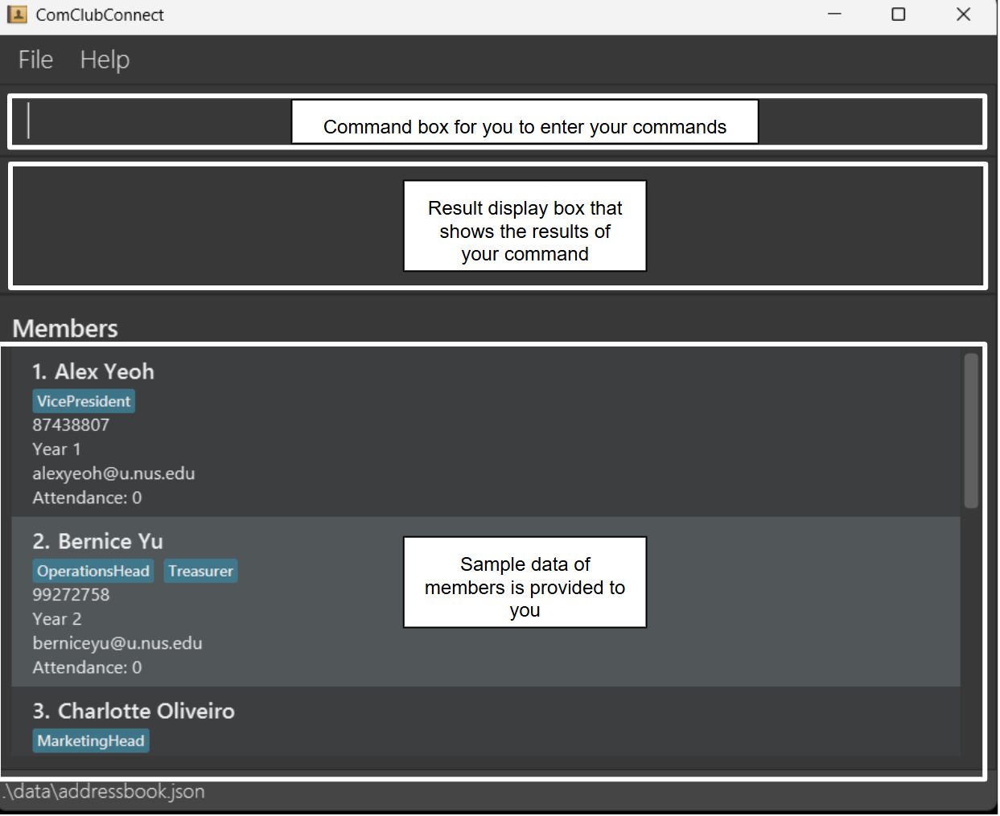
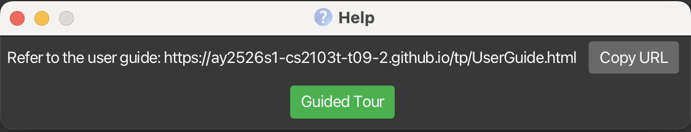
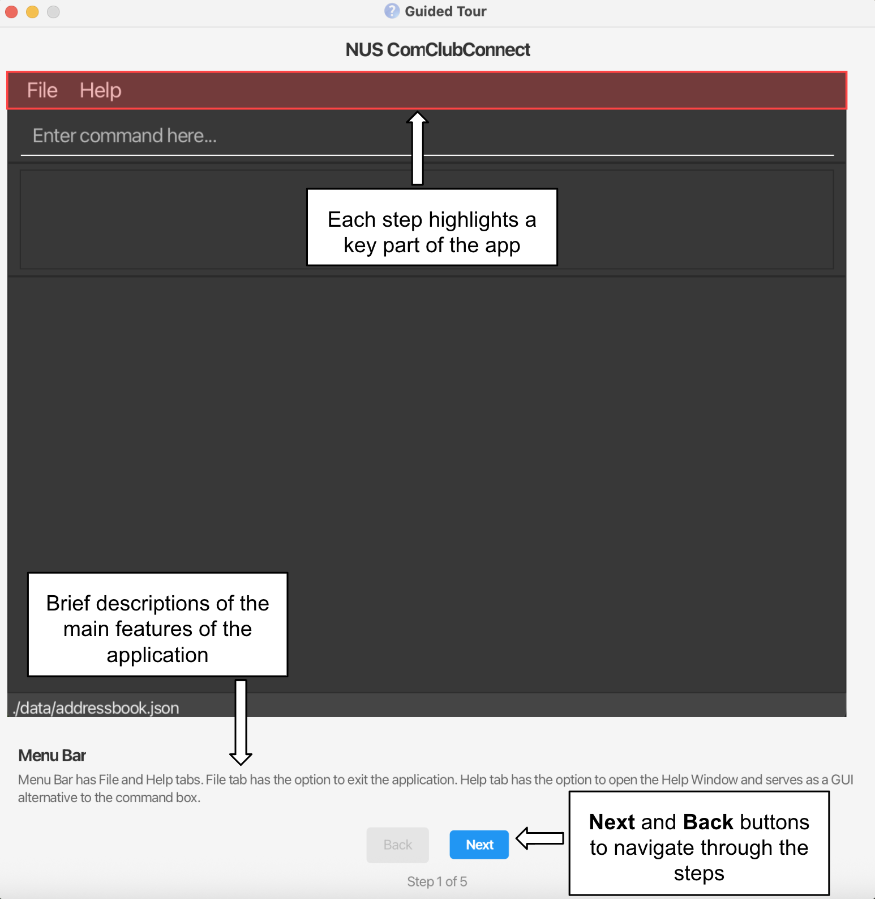

# ComClubConnect User Guide

ComClubConnect is a desktop app for <b>NUS CCA leaders</b> to <b>manage members and events</b>, optimised for use via a Command Line Interface (CLI) while still having an intuitive Graphical User Interface (GUI). If you are a fast typer, ComClubConnect helps you track members, plan events, and communicate changes faster than traditional spreadsheets or GUI-only apps.

* Table of Contents
  {:toc}

<strong>Quick Links</strong>

- [Quick Start](#quick-start)
- [About This Guide](#about-this-guide)
- [Features](#features)
- [Command Summary](#command-summary)
- [FAQ](#faq)
- [Troubleshooting](#troubleshooting)

--------------------------------------------------------------------------------------------------------------------

## About This Guide

This guide is written for NUS CCA leaders who need to maintain member records, plan events, and perform routine admin tasks quickly and accurately using a keyboard-first workflow.

Assumed prior knowledge:
- Comfortable using a command terminal on Windows / macOS / Linux.
- Basic familiarity with copying/pasting commands and editing plain text.
- Understands CCA context (roles, member lists, event details like date/time and venue).

How to use this guide:
- Quick start: run the app and try a few example commands.
- Features: step-by-step usage, command syntax, examples, expected output, tips and cautions.
- Troubleshooting and FAQ: common problems, reasons, and solutions.

[Back to top](#comclubconnect-user-guide)

--------------------------------------------------------------------------------------------------------------------

## Quick Start

### Step 1: Ensure you have Java 17 installed on your computer. 
> #### Checking your Java version:
> - Open a command terminal
>  - **Windows users**: Press Windows + R, type cmd, and press Enter
>  -  **Mac users**: Open Terminal from Spotlight (press ⌘ + Space, type Terminal)
>  -  **Linux users**: Open Terminal from your applications menu
> - Type `java -version` and press Enter
> - If Java is installed, you'll see the version number (e.g., `java version "17.0.1"`)
> - The first number should be 17
>
> #### If Java is not installed or the version is below 17:
> - Download and install Java 17 by following the guide:
>   - [for Windows users](https://se-education.org/guides/tutorials/javaInstallationWindows.html)
>   - [for Mac users](https://se-education.org/guides/tutorials/javaInstallationMac.html)
>   - [for Linux users](https://se-education.org/guides/tutorials/javaInstallationLinux.html)
> - After installation, restart your terminal and repeat the above steps to verify the version again

### Step 2: Download ComClubConnect
> Download the latest `.jar` file from [here](https://github.com/AY2526S1-CS2103T-T09-2/tp/releases).

### Step 3: Place the file in a folder
> Your app comes in a single file that ends with .jar (for example, addressbook.jar).
> You’ll need to decide where you want to keep this file — this will be your ComClubConnect home folder.
>   - Find your downloaded `.jar` file (for example, in your Downloads folder).
>   - Right-click the file and choose Copy.
>   - Go to your preferred folder where you want to keep the file
>   - Right-click an empty space and select Paste.

### Step 4: Run the application
> - Copy the pathname of the ComCLubConnect home folder
>   - **Windows users**: Right click on the folder and select "Copy as path"
>   -  **Mac users**: Right click on the folder and select "Copy as pathname"
>   -  **Linux users**: Right click on the folder and select "Copy path"
> - Open a command terminal as mentioned in step 2
> - Type `cd <copied filepath>` command to enter the folder
> - Type `java -jar addressbook.jar` command to run the application. 
   A GUI similar to the below should appear in a few seconds. Note that the app contains some sample data and the layout is explained in coloured boxes. 
   

--------------------------------------------------------------------------------------------------------------------

## Quick CLI Tutorial
- Click the command input box (top of the UI), type a command exactly as shown (prefixes like `n/`, `p/`, `e/`, `y/`, `r/`, `d/`, `v/` are required), then press Enter.
- Typical response types:
- Success message with brief summary (e.g., “New event added: …”).
- List output after `list` or `find` showing matching member/event entries.
- Error message beginning with “Invalid command format!” or a validation message — read it carefully and retry.
- Example sequence:
1. `add member n/John Doe p/98765432 e/johndoe@u.nus.edu y/1 r/President`
    - Expected output: “New person added: John Doe …”
2. `list member`
    - Expected output: member list including “John Doe”.
3. `find event n/Welcome`
    - Expected output: a filtered event list containing events with “Welcome” in the name.

5. Type your command in the command box and press Enter to execute it.
   Some example commands you can try:

- `help` : Shows the help window that provides a link to the User Guide, as well as an optional guided tour of the CLI interface.
- `list member` : Lists all members.
- `list event` : Lists all events.
- `add member n/John Doe p/98765432 e/johndoe@u.nus.edu y/1 r/President` : Adds a member named John Doe.
- `add event n/Welcome Tea d/2025-09-01T18:00 l/COM1-01-02` : Adds an event.
- `delete member 3` : Deletes the 3rd member shown in the current list.
- `clear event` : Deletes all events.
- `exit` : Exits the app.

[Back to top](#comclubconnect-user-guide)

--------------------------------------------------------------------------------------------------------------------

## Features

**Notes on command format**
- Some commands require a `TYPE` immediately after the command word: `member` or `event` (e.g., `add member`, `list event`).
- Words in `UPPER_CASE` are parameters you supply. For example, in `add member n/NAME`, `NAME` can be `John Doe`.
- Items in square brackets are optional. Items marked with `…` can repeat, including zero times.
- Parameters must follow the order for a command.
- Extraneous parameters for commands that do not take parameters (such as `help` and `exit`) are ignored.

**Prefix reference used in commands involving members**
- `n/` name
- `p/` phone (8 digits, starts with 8 or 9)
- `e/` email (must end with `@u.nus.edu`)
- `y/` year of study (`1`–`4`)
- `r/` role(s) — alphanumeric, can appear multiple times

**Prefix reference used in commands involving events**
- `n/` event name
- `d/` date-time in ISO format `YYYY-MM-DDTHH:MM`
- `v/` location

⚠️ <strong>Caution:</strong> If you are using a PDF version, commands that wrap across lines may lose spaces when copied — retype if needed.

### Viewing Help — `help`

Opens the Help window.

Format: `help`

### Guided Tour — `guidedtour`

Opens the Guided Tour window, which provides an overview of the key components of the Address Book interface.

Format: `guidedtour`

The Guided Tour walks you through major areas of the application — such as the **Menu Bar**, **Command Box**, **Result Display**, **Member/Event List Display**, and **Status Bar** — with color-coded highlights and brief explanations to help you get familiar with the interface.

✅ <strong>Tip: </strong> <code>F1</code> or use the Help menu to open the Help window quickly.

⚠️ <strong>Caution:</strong> If the Help window is minimized, running <code>help</code> again will not open a new window. Restore the minimized window instead.

### Adding Entries — `add`

Adds a member or an event.

Format (member): `add member n/NAME p/PHONE e/EMAIL y/YEAR r/ROLE…`

- `PHONE` must be 8 digits and start with `8` or `9`.
- `EMAIL` must be a valid NUS email ending with `@u.nus.edu`.
- `YEAR` must be one of `1`, `2`, `3`, or `4`.
- At least one `r/ROLE` must be provided; you can specify multiple roles.
- Duplicate check: member names are matched case-insensitively. Two members with the same name are considered duplicates.

Examples:
- `add member n/John Doe p/98765432 e/johndoe@u.nus.edu y/1 r/President`
- `add member n/Jane Tan p/91234567 e/janetan@u.nus.edu y/3 r/Treasurer r/Logistics`

Format (event): `add event n/NAME d/DATE_TIME l/LOCATION`

- `DATE_TIME` must be ISO local date-time: `YYYY-MM-DDTHH:MM` (e.g., `2025-09-01T18:00`).

Examples:
- `add event n/Welcome Tea d/2025-09-01T18:00 l/COM1-01-02`
- `add event n/CS Workshop d/2025-12-30T14:30 l/NUS COM2`

✅ <strong>Tip:</strong> Use multiple <code>r/</code> prefixes to add several roles at once, e.g., <code>r/President r/TechLead</code>.

⚠️ <strong>Caution:</strong> Dates must include the <code>T</code> separator (e.g., <code>2025-09-01T18:00</code>). Emails must end with <code>@u.nus.edu</code>.

### Listing Entries — `list`

Shows members or events and switches the main list view accordingly.

Format: `list TYPE`

- `TYPE` is either `member` or `event`.

Examples:
- `list member`
- `list event`

✅ <strong>Tip:</strong> After a successful <code>add</code> or <code>edit</code>, run <code>list</code> to refresh the view you care about.

⚠️ <strong>Caution:</strong> Extra words after <code>list TYPE</code> are not allowed (e.g., <code>list member now</code> is invalid).

### Editing Entries — `edit`

Edits an existing member or event.

Format (member): `edit member INDEX [n/NAME] [p/PHONE] [e/EMAIL] [y/YEAR] [r/ROLE]…`

- Edits the member at `INDEX` (1-based) in the displayed members list.
- At least one optional field must be provided.
- Providing one or more `r/ROLE` values replaces all existing roles.
- To clear all roles, use `r/` with no value.
- Changing a member’s name to one that matches an existing member (case-insensitive) is not allowed.

Examples:
- `edit member 1 p/91234567 e/johndoe@u.nus.edu`
- `edit member 2 n/Betsy Crower r/` (clears all roles)

Format (event): `edit event INDEX [n/NAME] [d/DATE_TIME] [l/LOCATION]`

Examples:
- `edit event 1 n/Welcome and Games Night`
- `edit event 2 d/2025-10-05T19:00 l/COM3-01-12`

✅ <strong>Tip:</strong> You can edit multiple fields in one command, e.g., <code>edit member 3 n/New Name p/91234567</code>.

⚠️ <strong>Caution:</strong> Ensure the <code>INDEX</code> refers to the currently displayed list (members vs. events).

### Finding Entries — `find`

Finds members or events matching the given criteria. Matching is case-insensitive and by whole words.

Format (members):
- `find member n/KEYWORDS…` — Find by member name.
- `find member y/KEYWORDS…` — Find by year of study.

Examples:
- `find member n/Alex David`
- `find member y/1 2`

Format (events):
- `find event n/KEYWORDS…` — Find by event name.
- `find event l/KEYWORDS…` — Find by event location.

Examples:
- `find event n/Welcome`
- `find event l/UTown COM1`

✅ <strong>Tip:</strong> Combine multiple keywords to broaden the match, e.g., <code>find event n/Welcome Games</code>.

⚠️ <strong>Caution:</strong> Searching by roles is not supported; use member name or year instead.

### Deleting Entries — `delete`

Deletes a member or event by its displayed index.

Format: `delete TYPE INDEX`

- `TYPE` is either `member` or `event`.
- `INDEX` refers to the index number shown in the current list and must be a positive integer.

Examples:
- `delete member 2`
- `delete event 1`

✅ <strong>Tip:</strong> Use <code>list member</code> or <code>list event</code> just before deleting to avoid index confusion.

⚠️ <strong>Caution:</strong> Deletions cannot be undone. Double-check the index before confirming.

### Clearing Entries — `clear`

Clears all members or all events.

Format: `clear TYPE`

- `TYPE` is either `member` or `event`.

Examples:
- `clear member`
- `clear event`

✅ <strong>Tip:</strong> Export a backup (copy the <code>data/addressbook.json</code> file) before bulk-clearing.

⚠️ <strong>Caution:</strong> This action deletes all entries of the chosen type. It cannot be undone.

### Aliasing Commands — `alias`

Creates a custom alias for a command word. Aliases apply for the current app session.

Format: `alias COMMAND_WORD ALIAS`

- Supported `COMMAND_WORD`s: `add`, `edit`, `delete`, `clear`, `find`, `list`, `help`, `exit`, `alias`.
- `ALIAS` must be a single word and not a built-in command word.

Examples:
- `alias delete rm` — After this, `rm member 1` works like `delete member 1`.
- `alias list ls`

✅ <strong>Tip:</strong> Choose aliases that mirror your team’s habits, e.g., <code>rm</code> for <code>delete</code>.

⚠️ <strong>Caution:</strong> Aliases are not saved between app runs.

### Exiting — `exit`

Exits the program.

Format: `exit`

--------------------------------------------------------------------------------------------------------------------

## Saving Your Data

Data is saved to disk automatically after any command that changes data. No manual save is needed.

--------------------------------------------------------------------------------------------------------------------

## Editing the Data File (Advanced)

Data is saved as a JSON file at `[JAR file location]/data/addressbook.json`.

⚠️ <strong>Caution:</strong> If the JSON format becomes invalid, the app will start with an empty data file on the next run. Make a backup first. Invalid values (e.g., non-<code>@u.nus.edu</code> emails or malformed dates) may cause unexpected behavior.

[Back to top](#comclubconnect-user-guide)

--------------------------------------------------------------------------------------------------------------------

## FAQ

- Can I import my existing member list from Excel/Google Sheets?
 - Not directly. You can copy key details and add members using `add member ...`. Power users can transform CSV to match `addressbook.json`, but be careful with format.

- Do aliases persist across restarts?
 - No. Aliases last for the current session only.

- Why does my email keep getting rejected?
 - Emails must end with `@u.nus.edu` and have a valid local-part (alphanumeric plus `+ _ . -`, not starting/ending with a special character).

- What phone numbers are allowed?
 - Exactly 8 digits, starting with `8` or `9`, and no spaces.

- How do I record multiple roles for a member?
 - Repeat the `r/` prefix, e.g., `r/President r/TechLead`. Roles are alphanumeric and cannot contain spaces.

- Can I search by role or by event date range?
 - Role-based search and date-range filters are not supported currently. You can search members by name or year, and events by name or location.

- I entered `2025-09-01 18:00` but got an invalid date. Why?
 - Use ISO format with `T` between date and time: `2025-09-01T18:00`.

- I deleted the wrong person/event. Can I undo?
 - Undo is not available. Consider exporting a backup (`data/addressbook.json`) periodically.

- How do I move my data to another computer?
 - Copy your `addressbook.json` from the `data` folder next to your `.jar` into the same location on the new machine before running the app there.

- The app says it can’t save due to permissions. What should I do?
 - Move the `.jar` file to a folder you have write access to (e.g., your home folder or desktop) and run it again.

- Can multiple EXCO members use the same data file?
 - Yes. Share the `addressbook.json` file via a cloud drive, but ensure only one person runs the app and edits the file at a time to avoid conflicts.

- Will names be treated as duplicates if capitalization differs?
 - Yes. Member name matching is case-insensitive for uniqueness (e.g., `John Doe` and `john doe` are considered the same).

[Back to top](#comclubconnect-user-guide)

--------------------------------------------------------------------------------------------------------------------

## Troubleshooting

Problem: “Invalid command format!”
- Reason: Missing required parts or extra unexpected text.
- Solution: Compare with the command’s “Format” in this guide; remove extras and include all required prefixes.

Problem: “Phone number must be exactly 8 digits and start with 8 or 9.”
- Reason: The number contains spaces, wrong length, or starts with other digits.
- Solution: Enter an 8-digit number starting with 8 or 9, with no spaces.

Problem: “Emails should be of the format local-part@u.nus.edu …”
- Reason: Email is not an NUS email or local-part is invalid.
- Solution: Use a valid NUS email like `alexlee@u.nus.edu`.

Problem: “Dates should be in ISO format YYYY-MM-DDTHH:MM”
- Reason: Missing the `T` separator or wrong format.
- Solution: Enter `YYYY-MM-DDTHH:MM` (e.g., `2025-10-05T19:00`).

Problem: “Unknown command”
- Reason: Typos or using a command that does not exist.
- Solution: Run `help` to see supported commands. Consider creating an alias for frequently used commands.

Problem: “Could not save data due to insufficient permissions …”
- Reason: The current folder is read-only.
- Solution: Move the `.jar` to a writable folder and run it again.

[Back to top](#comclubconnect-user-guide)

--------------------------------------------------------------------------------------------------------------------

## Known Issues

1. When using multiple screens, if you move the application to a secondary screen, and later switch to only the primary screen, the GUI may open off-screen. Remedy: delete `preferences.json` in the app folder and start again.
2. If you minimize the Help window and run `help` again, the original Help window remains minimized and no new Help window appears. Remedy: restore the minimized Help window.

[Back to top](#comclubconnect-user-guide)

--------------------------------------------------------------------------------------------------------------------

## Command Summary

<table class="command-summary">
<thead>
<tr>
<th style="width: 20%;">Action</th>
<th style="width: 80%;">Format Examples</th>
</tr>
</thead>
<tbody>
<tr>
<td><strong>add</strong></td>
<td>
<strong>Member:</strong> <code>add member n/Alex Tan p/91234567 e/alextan@u.nus.edu y/2 r/Logistics</code>

<strong>Event:</strong> <code>add event n/Welcome Tea d/2025-09-01T18:00 v/COM1-01-02</code>
</td>
</tr>
<tr>
<td><strong>edit</strong></td>
<td>
<strong>Member:</strong> <code>edit member 2 e/alextan@u.nus.edu p/98765432</code>

<strong>Event:</strong> <code>edit event 1 d/2025-10-05T19:00 v/COM3-01-12</code>
</td>
</tr>
<tr>
<td><strong>delete</strong></td>
<td>
<strong>Member:</strong> <code>delete member 3</code>

<strong>Event:</strong> <code>delete event 1</code>
</td>
</tr>
<tr>
<td><strong>list</strong></td>
<td>
<strong>Member:</strong> <code>list member</code>

<strong>Event:</strong> <code>list event</code>
</td>
</tr>
<tr>
<td><strong>find</strong></td>
<td>
<strong>Member:</strong> <code>find member n/Alex</code>, <code>find member y/1</code>

<strong>Event:</strong> <code>find event n/Welcome</code>, <code>find event v/COM1</code>
</td>
</tr>
<tr>
<td><strong>clear</strong></td>
<td>
<strong>Member:</strong> <code>clear member</code>

<strong>Event:</strong> <code>clear event</code>
</td>
</tr>
<tr>
<td><strong>alias</strong></td>
<td><code>alias delete rm</code>, <code>alias list ls</code></td>
</tr>
<tr>
<td><strong>help</strong></td>
<td><code>help</code></td>
</tr>
<tr>
<td><strong>exit</strong></td>
<td><code>exit</code></td>
</tr>
</tbody>
</table>

[Back to top](#comclubconnect-user-guide)
